[options="header"]
[cols="1, 3, 3"]
|===
|Version | Datum   | Autor
|1.1	| Januar, 15, 2020 | Gruppe 40
|===

:project_name: NBB British Bike Tours
:company_name: Chair of Software Technology
:toc: left
:numbered:

= Entwicklerdokumentation

== Einführung und Ziele
=== Aufgabenstellung

Die NBB British Bike Tours veranstaltet exklusiv für deutsche Touristen kulturell anspruchsvolle, geführte Fahrradtouren in Großbritannien, u.a.:  +

* Edinbourgh Tour +
* London Tour +
* Wales Tour +
* und, und, und, ... +

Die Touren werden von erfahrenen Reiseleitern geführt und von einem Tross (Bus für Fahrradmüde mit Ersatzteilen und Rädern,
Proviant, medizinischer Versorgung etc.) begleitet. Alle Fahrräder werden vom Veranstalter gestellt und gewartet.
Die Touren werden laufend in verschiedenen Preiskategorien angeboten: +

* Touristen der Economy Class übernachten in Jugendherbergen oder in bereitgestellten Zeltlagern in ihren eigenen Schlafsäcken.
Die Gemeinschaftsverpflegung ist einfach. Die gestellten Fahrräder sind robust und praktisch. Anreise per Bahn und Schiff. +
* In der Standard Class übernachtet man in B&B-Zimmern und besucht auf eigene Faust in den Pubs der Umgebung (Tipps dazu vom Reiseleiter).
Fahrräder wie in der Economy Class. Anreise in eigener Regie. +
* Kunden der Luxury Class übernachten in Hotels und Landsitzen mit vorzüglicher Küche. Fahrräder besonders gut gefedert, auf Wunsch
mit elektrischem Hilfmotor. Anreise per Flugzeug. +

Die NBB British Bike Tours benötigen für ihren Firmensitz in Neubiberg bei München Verwaltungssoftware zur Planung und Organisation von
Reiseangeboten sowie zur Abwicklung von Anfragen, Buchungen, Stornierungen seitens der Kunden per Telefon, FAX, email oder persönlich.
Aus dem Veranstaltungskatalog soll automatisch ein Online-Katalog auf der Homepage des Veranstalters generiert werden.
Mit der Zentrale und den über ganz Großbritannien verteilten Versorgungsstationen sind künftig (per Internet) Notebooks verbunden, die
von jedem Tross mitgeführt werden, um Ersatzteilanforderungen, Krankheits- und Versicherungsfälle zu melden. Reiseleitung und Teilnehmer
haben auf diese Weise jederzeit Verbindung zur Zentrale.
Teilnehmer erhalten je Reise einen Treuepunkt. Ab drei Treuepunkten können sie am Ende einer Reise das verwendete Fahrrad günstig
erwerben: Der Preis ergibt sich aus dem Ladenpreis, der sich für jeden Treuepunkt um 10 % verringert. Mit Erwerb des Fahrrads
sind die Treuepunkte verbraucht.
Ihre Aufgabe ist es, auf der Grundlage von SalesPoint einen Prototypen dieser Software zu erstellen, in dem die Abteilungen der Zentrale
von NBB British Bike Tours, die Versorgungsstationen sowie die von den Reisegruppen mitgeführten Notebooks als eigene SalesPoints emuliert
werden. Der Kunde möchte damit sein Geschäftsmodell überarbeiten.

=== Qualitätsanforderungen

Um die Qualität der Software zu gewährleisten, existieren Produktansprüche, welche erfüllt werden müssen. +
_Hinweis: Die folgenden Punkte stammen von: https://iso25000.com/index.php/en/iso-25000-standards/iso-25010[ISO/IEC 25010 Software Quality Model^]._

Wartbarkeit::
Dieses Merkmal stellt den Grad an Effektivität und Effizienz dar, mit dem ein Produkt oder System modifiziert werden kann, um es zu verbessern,
zu korrigieren oder an Veränderungen in der Umwelt und in den Anforderungen anzupassen.

Benutzerfreundlichkeit::
Definiert den Grad, in dem ein Produkt oder System von ausgewählten Benutzern verwendet werden kann, um bestimmte Ziele mit Effektivität, Effizienz
und Zufriedenheit in einem gewissen Anwendungskontext zu erreichen.

Sicherheit::
Der Grad, in dem ein Produkt oder System Informationen und Daten schützt, so dass Personen oder andere Produkte oder Systeme nur enstsprechend
ihrer Berechtigungen Datenzugriff haben.

Die folgende Tabelle zeigt, welche Qualitätsanforderungen in welchem Umfang erfüllt werden müssen.
In der ersten Spalte sind die Qualitätsanforderungen aufgeführt, während in den folgenden Spalten ein x zur Kennzeichnung der Priorität
verwendet wird.
Die zugewiesene Priorität ist bei der Formulierung der konkreten nichtfunktionalen Anforderungen zu berücksichtigen.

1 = Nicht wichtig ..
5 = Sehr wichtig
[options="header", cols="3h, ^1, ^1, ^1, ^1, ^1"]
|===
|Qualitätsanforderungen   | 1 | 2 | 3 | 4 | 5
|Wartbarkeit          	  |   |   |   | x |
|Benutzerfreundlichkeit   |   |   | x |   |
|Sicherheit               |   |   |   | x |
|===

== Randbedingungen
=== Hardwarespezifikationen
Eine Liste der notwendigen Geräte/Hardware, um die Anwendung auszuführen und zu nutzen.

* Server
* Computer
* Tastatur
* Maus

=== Softwarespezifikationen
Eine Liste notwendiger Software zum Ausführen und Verwenden der Anwendung.

Die folgende (oder neuere) Javaversion ist notwendig zum Ausführen der Anwendung.

* Java 11

Die folgende (oder neuere) Webversion ist notwendig zum Ausführen der Anwendung.

* Internet Explorer / Edge 10.0
* Firefox 4.0
* Google Chrome 4.0
* Opera 9.6

=== Produktbenutzung
Dieser Abschnitt gibt einen Überblick darüber, wie und unter welchen Umständen das Produkt nach Fertigstellung eingesetzt werden soll.

Das System wird vom NBB British Bike Tours als Webshop genutzt, um Touren zu verkaufen.
Die Software soll auf einem Server laufen und über das Internet (über einen Browser) für interessierte Kunden rund um die Uhr verfügbar sein.

Die Hauptnutzer der Software sind Reiseinteressierte, die unterschiedlichste Erfahrungen mit Webseiten haben.

Das System benötigt keine technische Wartung, da das Personal des NBB British Bike Tours bereits alle Hände voll zu tun hat.
Alle Daten müssen persistent in einer Datenbank gespeichert und über die Anwendung zugänglich sein (z. B. sollten für einen Chef keine
SQL-Kenntnisse erforderlich sein).

== Kontext und Umfang

=== Kontextdiagramm

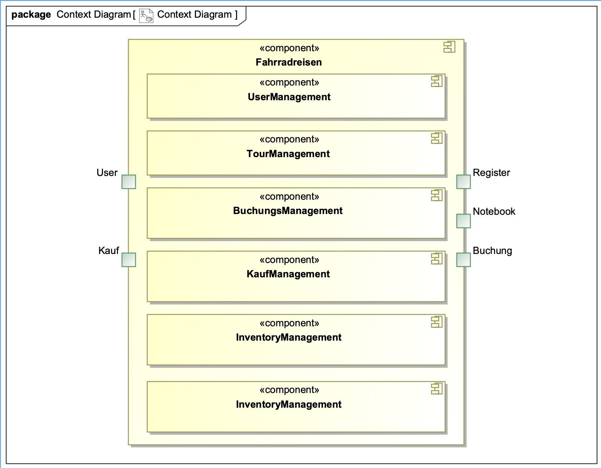

_Kontextdiagramm der Anwendung_

== Lösungsstrategien
=== Erfüllung der Qualitätsanforderungen

[options="header"]
|===
|Qualitätsanforderungen |Lösungsansatz
|Wartbarkeit a|
* *Modularität* Setzen Sie die Anwendung aus diskreten Komponenten zusammen, so dass Änderungen an einer Komponente weniger Auswirkungen auf andere Komponenten haben.
* *Wiederverwendbarkeit* Stellen Sie sicher, dass Komponenten des Systems von anderen Komponenten oder Systemen wiederverwendet werden können.
* *Veränderbarkeit* Stellen Sie sicher, dass die Anwendung geändert oder erweitert werden kann, ohne Fehler zu machen oder die Produktqualität zu beeinträchtigen.
|Benutzerfreundlichkeit a|
* Lernfähigkeit* Stellen Sie sicher, dass das System für seine Benutzer leicht zu bedienen und zu verstehen ist. Dies kann z. B. dadurch erreicht
werden, dass der Inhalt von Eingaben mit Labels oder Tooltips eindeutig beschrieben wird.
* *Benutzer-Fehlerschutz/Fehlerbehandlung* Benutzer vor Fehlern schützen. Ungültige Eingaben dürfen nicht zu ungültigen Systemzuständen führen.
* *Ästhetik der Benutzeroberfläche* Bietet eine angenehme und zufriedenstellende Interaktion für den Benutzer.
* Zugänglichkeit* Stellen Sie sicher, dass Personen mit einer Vielzahl von Merkmalen das System vollständig nutzen können. Dies kann z. B. durch geeignete Schriftgrößen und Farbkontraste realisiert werden.
|Sicherheit a|
* *Vertraulichkeit* Stellen Sie sicher, dass nur Personen, die dazu berechtigt sind, auf Daten zugreifen können. Dies kann mit _Spring Security_ und _Thymeleaf_ (`sec:authorize` - tag) realisiert werden.
* *Integrität* Verhindern Sie unbefugte Änderungen von Daten. Dies kann mit _Spring Security_ (`@PreAuthorize` - Annotation) realisiert werden.
* *Verantwortlichkeit* Rückverfolgbarkeit von Handlungen oder Ereignissen auf eine eindeutige Einheit oder Person. Für diese Anwendung sollte jeder `Auftrag` mit einem `Kunden` verknüpft werden.
|===

=== Softwarearchitektur

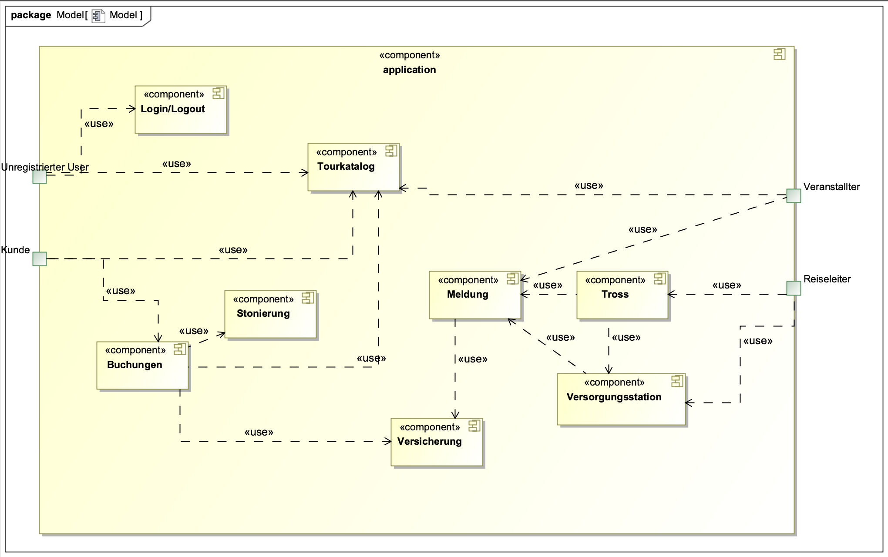

_Top Level Architektur der Anwendung_

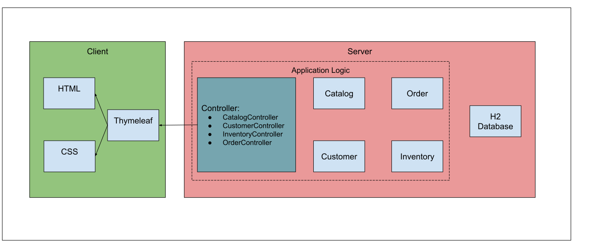

_Client Server Modell der Anwendung. Der Client enthält nur HTML und CSS Dateien. Die Anwendungslogik obliegt dem Server._

*Hinweis: JavaScript wird vom Client kompiliert. Sie können JavaScript in Ihrer Anwendung verwenden, achten Sie aber darauf, dass Sie es nicht zur Implementierung der Anwendungslogik verwenden!*

HTML-Templates werden clientseitig mit den entsprechenden CSS-Stylesheets dargestellt. Die in den Vorlagen angezeigten Daten werden von Thymeleaf bereitgestellt. Thymeleaf erhält die angeforderten Daten
durch die Controller-Klassen, die im Backend implementiert sind. Diese Controller-Klassen hingegen verwenden Instanzen und Methoden der Modellklassen. Standardmäßig speichert eine darunterliegende
H2-Datenbank Daten dauerhaft.

=== Architekturentscheidungen

==== Design Patterns
* Spring MVC

==== Persistenz
Die Anwendung verwendet *hybernetisch annotiert basiertes Mapping*, um Java-Klassen auf Datenbanktabellen abzubilden. Als Datenbank wird *H2* verwendet.
Die Persistenz ist standardmäßig deaktiviert. Um die Persistenzspeicherung zu aktivieren, müssen die folgenden beiden Zeilen in der Datei _application.properties_ kommentiert werden:
....
# spring.datasource.url=jdbc:h2:./db/videoshop
# spring.jpa.hibernate.ddl-auto=update
....

==== Benutzeroberfläche
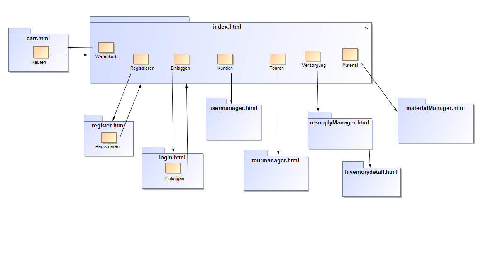

_Hinweis: Die blauen Kästen zeigen ein HTML-Template. Die weißen Kästen innerhalb der Vorlagen stellen Schaltflächen dar, die zu den Vorlagen umleiten, auf die ihre ausgehenden Pfeile zeigen._

==== Benutzung externer Frameworks
[options="header", cols="1,3,2"]
|===
|externe Klasse |Pfad der externen Klasse |benutzt von (applications' class)
|Salespoint.BusinessTime |org.salespointframework.time.BusinessTime |catalog.CatalogController
|Salespoint.Cart |org.salespointframework.order.Cart| order.OrderController
|Salespoint.Cash |org.salespointframework.payment.Cash |order.OrderController
|Salespoint.Catalog |org.salespointframework.catalog.Catalog |catalog.VideoCatalog
|Salespoint.DataInitializer |org.salespointframework.core.DataInitializer a|
* catalog.CatalogInitializer
* customer.CustomerDataInitializer
* inventory.InventoryInitializer
|Salespoint.UniqueInventory |org.salespointframework.inventory.UniqueInventory a|
* catalog.CatalogController
* inventory.InventoryController
* inventory.InventoryInitializer
|Salespoint.UniqueInventoryItem |org.salespointframework.inventory.UniqueInventoryItem |inventory.InventoryInitializer
|Salespoint.Order |org.salespointframework.order.Order |order.OrderController
|Salespoint.OrderManager |org.salespointframework.order.OrderManager |order.OrderController
|Salespoint.OrderStatus |org.salespointframework.order.OrderStatus|order.OrderController
|Salespoint.Product |org.salespointframework.catalog.Product a|
* catalog.Disc
* order.OrderController
|Salespoint.Quantity |org.salespointframework.quantity.Quantity a|
* catalog.CatalogController
* inventory.InventoryInitializer
* order.OrderController
|Salespoint.Role |org.salespointframework.useraccount.Role a|
* customer.CustomerDataInitializer
* customer.CustomerManagement
|Salespoint.SalespointSecurityConfiguration |org.salespointframework.SalespointSecurityConfiguration |videoshop.WebSecurityConfiguration
|Salespoint.UserAccount |org.salespointframework.useraccount.UserAccount a|
* customer.Customer
* order.OrderController
|Salespoint.UserAccountManager |org.salespointframework.useraccount.UserAccountManager a|
* customer.CustomerDataInitializer
* customer.CustomerManagement
|Spring.Assert |org.springframework.util.Assert a|
* customer.CustomerController
* customer.CustomerDataInitializer
* order.OrderController
|Spring.CrudRepository |org.springframework.data.repository.CrudRepository |customer.CustomerRepository
|Spring.Errors |org.springframework.validation.Errors |customer.CustomerController
|Spring.HttpSecurity |org.springframework.security.config.annotation.web.builders.HttpSecurity| videoshop.WebSecurityConfiguration
|Spring.Model |org.springframework.ui.Model a|
* catalog.CatalogController
* customer.CustomerController
* inventory.InventoryController
* order.OrderController
|Spring.Sort |org.springframework.data.domain.Sort |catalog.VideoCatalog
|Spring.SpringApplication |org.springframework.boot.SpringApplication |videoshop.VideoShop
|Spring.Streamable |org.springframework.data.util.Streamable |customer.CustomerManagement
|Spring.ViewControllerRegistry |org.springframework.web.servlet.config.annotation.ViewControllerRegistry |videoshop.VideoShopWebConfiguration
|Spring.WebMvcConfigurer |org.springframework.web.servlet.config.annotation.WebMvcConfigurer |videoshop.VideoShopWebConfiguration
|===

== Package

=== Fahrradreisen

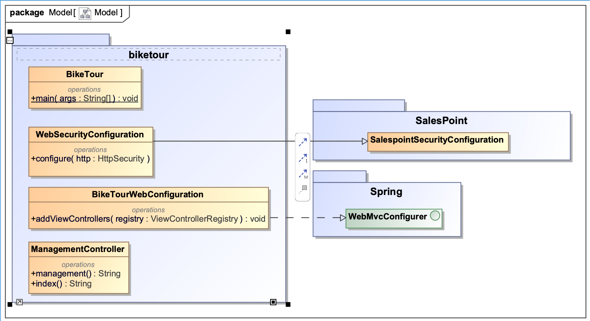

[options="header"]
|===
|Class/Enumeration |Description

|BikeTour|Zentrale Application zum konfigurieren des Spring Containers und anschließendem Run
|BikeTourWebConfiguration|Klasse zum Konfigurieren des `/login` Pfades zum `login.html` Template
|WebSecurityConfiguration|Klasse zum Erstellen der Basis Sicherheit und der Login/Logout Optionen
|===

=== User

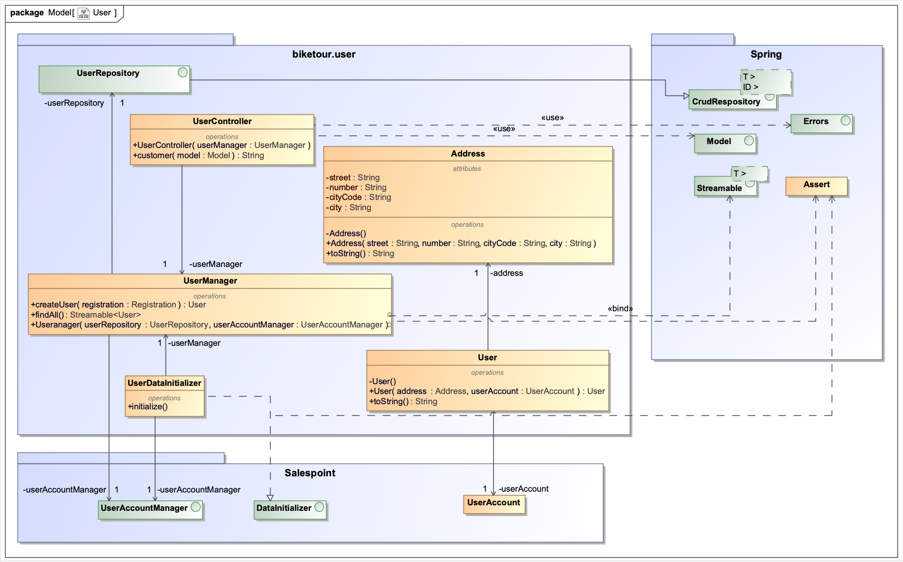

[options="header"]
|===
|Class/Enumeration |Description
|User|Klassenobjekt User
|Adresse|Klassenobjekt Adress
|UserController|MVC Controller zum Händeln der Anfragen zwischen View und Model
|UserManager|Service Class zum Managen aller User
|USerRepository|Ein Repository Interface zum Verwalten der User Instanzen
|UserDataInializer|Klasse zum Initialisieren von Usern
|===

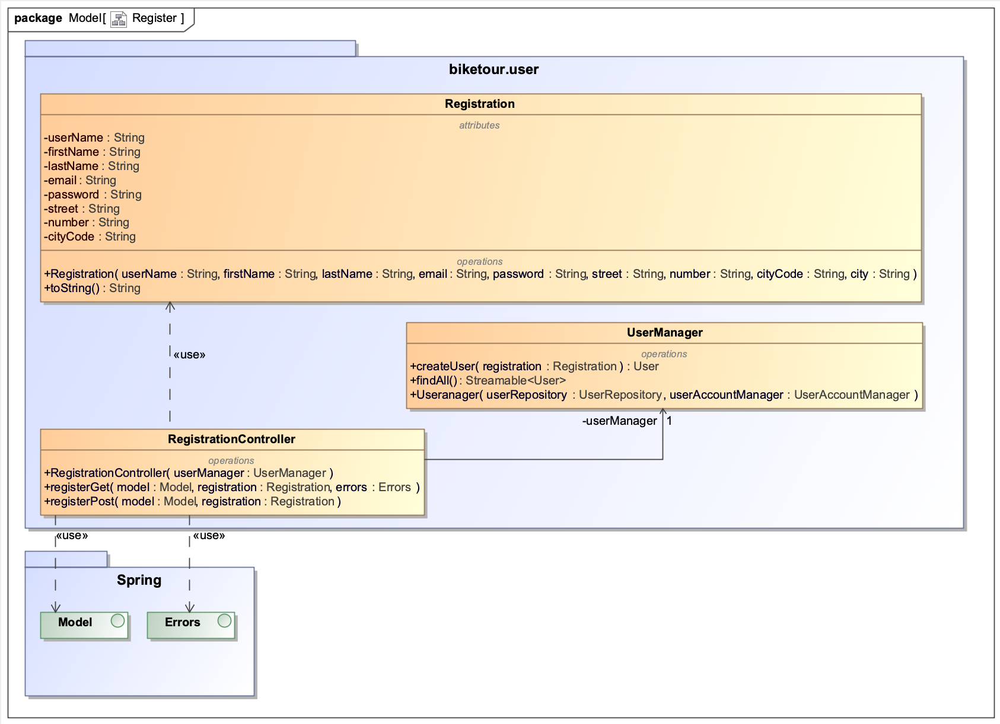

[options="header"]
|===
|Class/Enumeration |Description
|Registration|Klassenobjekt Registration
|RegisterController|MVC Controller zum Händeln der Anfragen zwischen View und Model
|UserManager|Service Class zum Managen aller User
|===

=== Tour

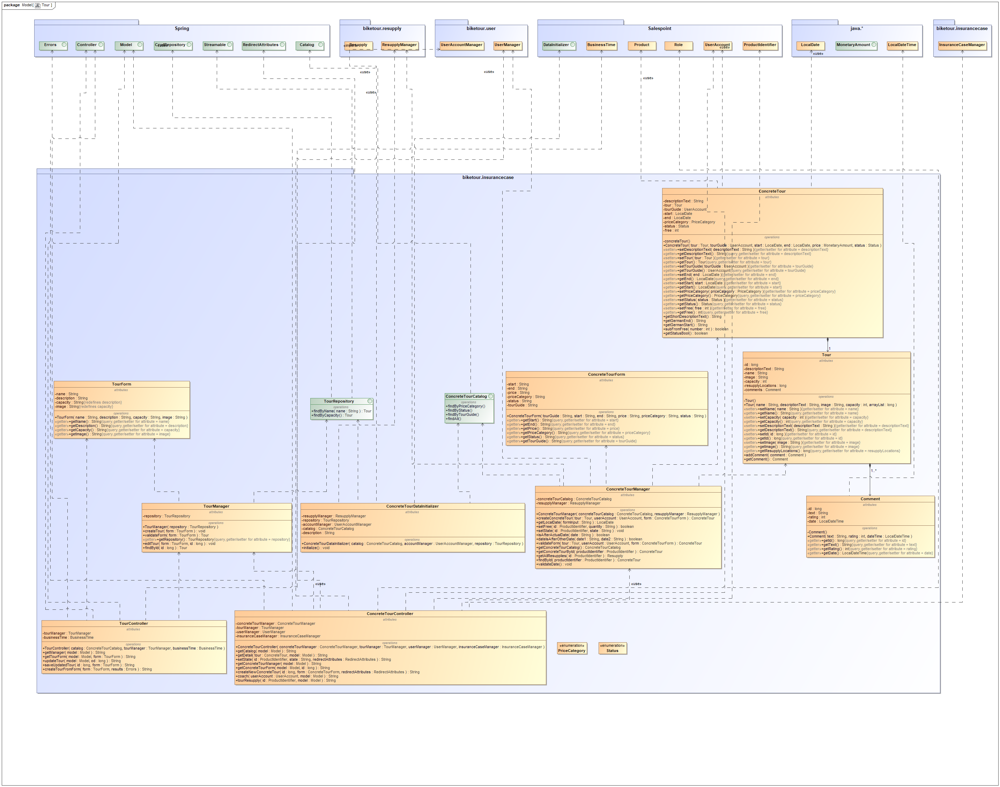

[options="header"]
|===
|Class/Enumeration |Description
|Tour     | Klasse Tour erweitert die SalesPoint Klasse Produkt mit weiteren tourrelevanten Attributen
|TourCatalog     |Repository Interface, welches die Tour-Instanzen managed
|TourDataInitializer     | Klasse, die das Programm mit Dummy Data versorgt
|TourForm     | Formular-Klasse, um vom User eingegebene Daten validiert
|TourManager         |Service Klasse zum Managen aller Touren
|TourManagerController         | MVC Controller zur Bearbeitung der Anfragen zwischen Model und View
|Comment  | Klasse, die Kommentare ermöglicht
|ConcreteTour| hat gleiche Klassen wie Tour, ist aber zuständig für das erstellen einer konkreten Tour
|===

=== Material

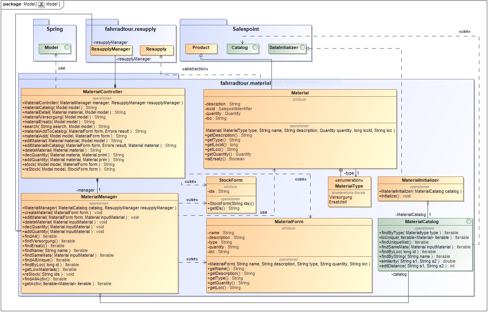

[options="header"]
|===
|Class/Enumeration |Description
|MaterialController|MVC Controller zur Bearbeitung der Anfragen zwischen Model und View
|MaterialManager| Serviceklasse zum Managen von allen Materialien
|MaterialInitializer|Klasse, die das Programm mit Dummy Materialien versorgt
|Material|ist ein Produkt von salespoint und hat Materialeigenschaften
|MaterialType|ist eine Klasse um das Material einzuteilen
|MaterialForm|Formular-Klasse um eingegebene Daten zu validieren
|MaterialCatalog|Repository Interface um Materialien zu verwalten
|StockForm|Formular für die Bestellung der Materialen
|===

=== Purchase

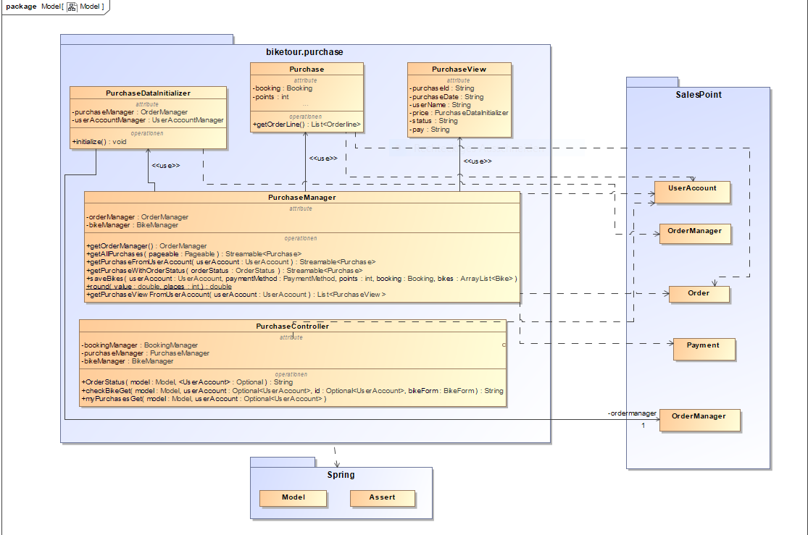

[options="header"]
|===
|Class/Enumeration |Description
|PurchaseController|MVC Controller zum Händeln von Fahrradkäufen
|Purchase | Klassenobjekt für Kauf
|PurchaseManager|Serviceklasse zum Managen aller Fahrradkäufe
|===

=== Resupply

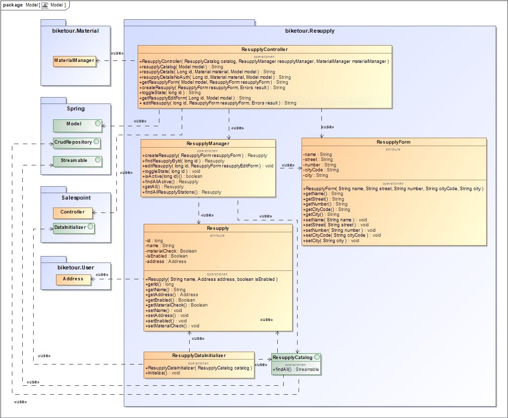

[options="header"]
|===
|Class/Enumeration |Description
|Resupply   |Klassenobjekt für Versorgungstation
|ResupplyCatalog    |Repository Interface für die Versorugsstationsmanagement
|ResupplyManager    |Serviceklasse zum Managen von allen Versorgungsstationen
|ResupplyInitializer| Klasse die placeholder data für Resupply generiert
|ResupplyController|MVC Controller zum Händeln von Resupplies
|ResupplyForm|Formular für eine Versorgungsstation
|===

=== Booking

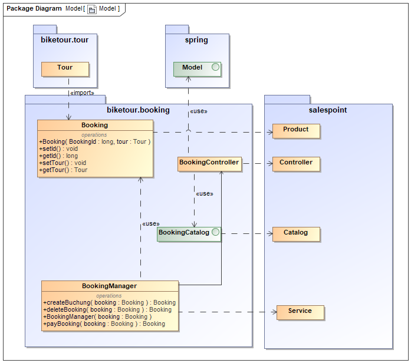

[options="header"]
|===
|Class/Enumeration |Description
|Booking| Klassenobjekt Booking (Buchung)
|BookingController| MVC Controller zum Händeln der Anfragen zwischen View und Model
|BookingManager| Service Class zum Managen der Buchungen
|===

=== Bike

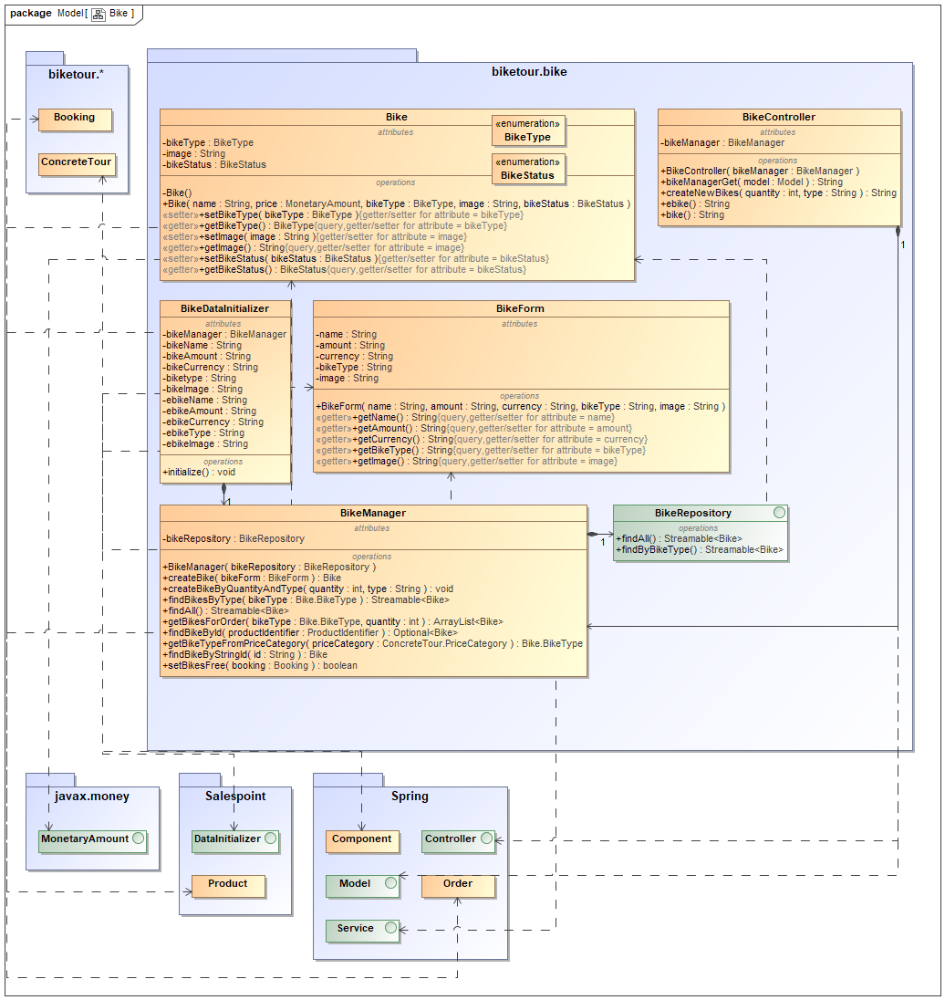

[options="header"]
|===
|Class/Enumeration|Description
|Bike|Klassenobjekt Fahrrads
|BikeController|MVC Controller zum Händeln von Resupplies
|BikeManager|Serviceklasse zum Managen aller Fahrräder
|BikeForm|Formular für ein Fahhrad
|BikeDataInitializer|Klasse, die Fahrrad Dummys erstellt
|===

=== Cart
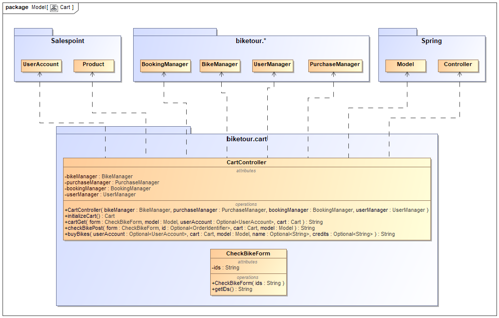

[options="header"]
|===
|Class/Enumeration|Description
|CartController|MVC Controller zum Händeln des Warenkorbs
|===

=== InsuranceCase
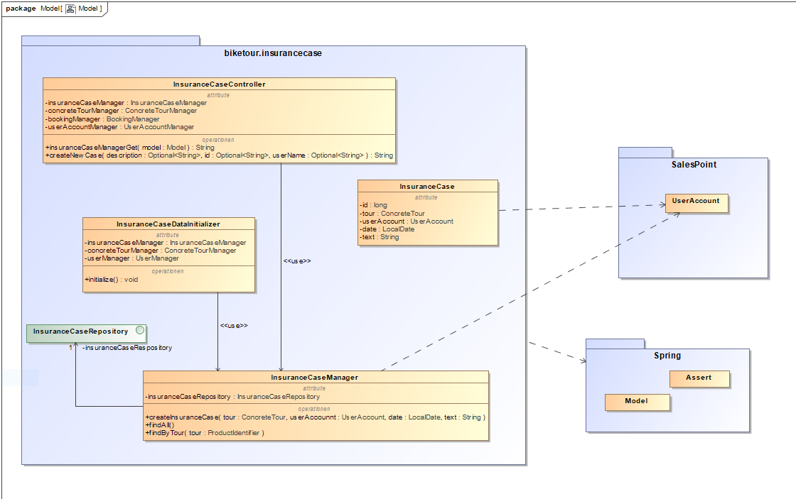

[options="header"]
|===
|Class/Enumeration|Description
|InsuranceCase|Klassenobjekt für Versicherungsfall
|InsuranceCaseController|MVC Controller zum Händeln von Versicherungsfällen
|InsuranceCaseManager|Serviceklasse zum Managen von Versicherungsfällen
|InsuranceCaseDataInitializer|Initializiert Versicherungsfälle, wenn sie erstellt werden
|===

=== Update

[options="header"]
|===
|Class/Enumeration|Description
|PasswordUpdateForm|Formular für das ändern des Passwortes
|UpdateController|MVC Controller zum Händeln der Daten eines Useraccounts (für User)
|UserUpdateForm|Formular für das Verändern der Nutzerdaten
|===

=== Traceability between Analysis- and Design Model
_Hinweis: Die folgende Tabelle zeigt die Vorwärts- und Rückwärtsrückverfolgbarkeit vom Analysemodell zum Designmodell und umgekehrt. Wenn im Designmodell eine externe Klasse verwendet wird, wird die Art der Verwendung in der Spalte Usage-Column definiert._

[options="header"]
|===
|Class/Enumeration (Analysis Model) |Class/Enumeration (Design Model) |Usage
|BluRay                 |catalog.Disc, catalog.DiscType |
|Cart                   |Salespoint.Cart | Simple Reuse
|CartItem               |Salespoint.CartItem (part of Salespoint Implementation) | Simple Reuse
|ChargeLine             |Salespoint.ChargeLine (part of Salespoint Implementation) | Simple Reuse
|Comment                |catalog.Comment |
|Dvd                    |catalog.Disc, catalog.DiscType |
|Inventory              |Salespoint.UniqueInventory | Simple Reuse
|InventoryItem          |Salespoint.UniqueInventoryItem | Simple Reuse
|Order                  |Salespoint.Order | Simple Reuse
|OrderLine              |Salespoint.Orderline (part of Salespoint Implementation) | Simple Reuse
|OrderManager           |Salespoint.OrderManager<Order> | Simple Reuse
|OrderStatus            |Salespoint.OrderStatus | Simple Reuse
|ROLE/Role              |Salespoint.Role | Simple Reuse
|User                   |Salespoint.UserAccount, customer.Customer | Simple Reuse
|Videoshop              |videoshop.Videoshop |
|===

== Runtime view

=== User

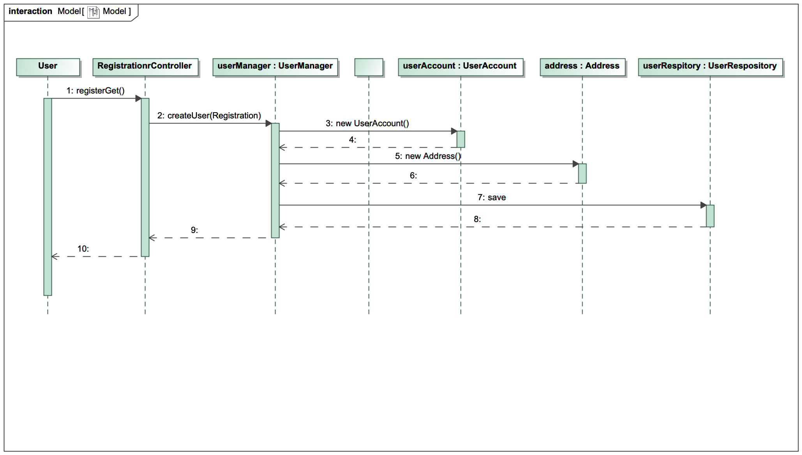
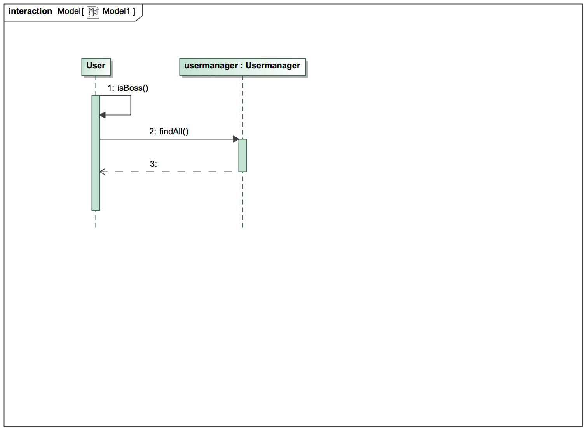
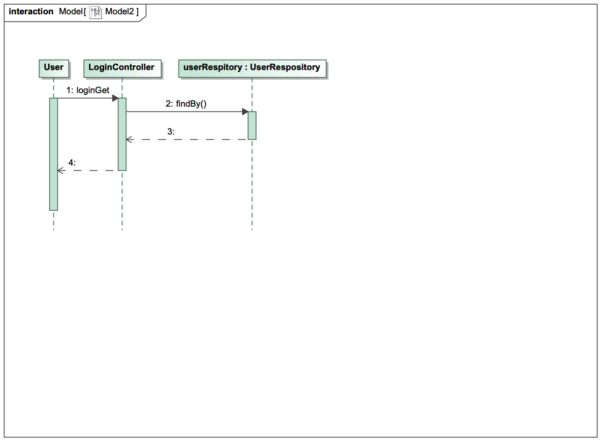

=== Inventory

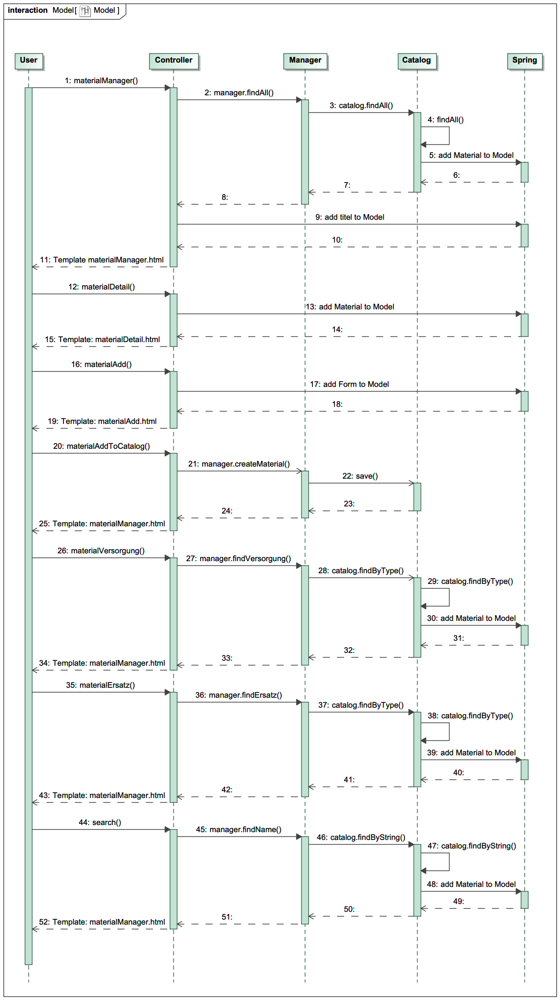

=== Tour

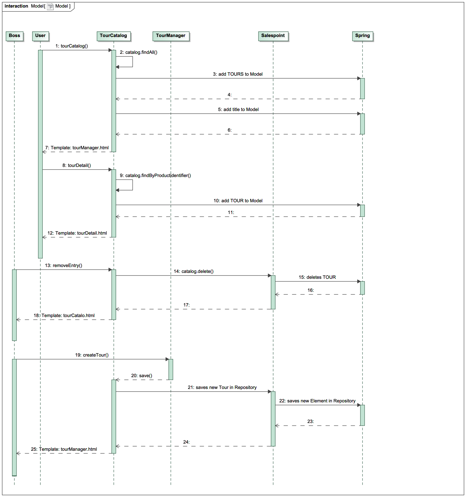

=== Resupply

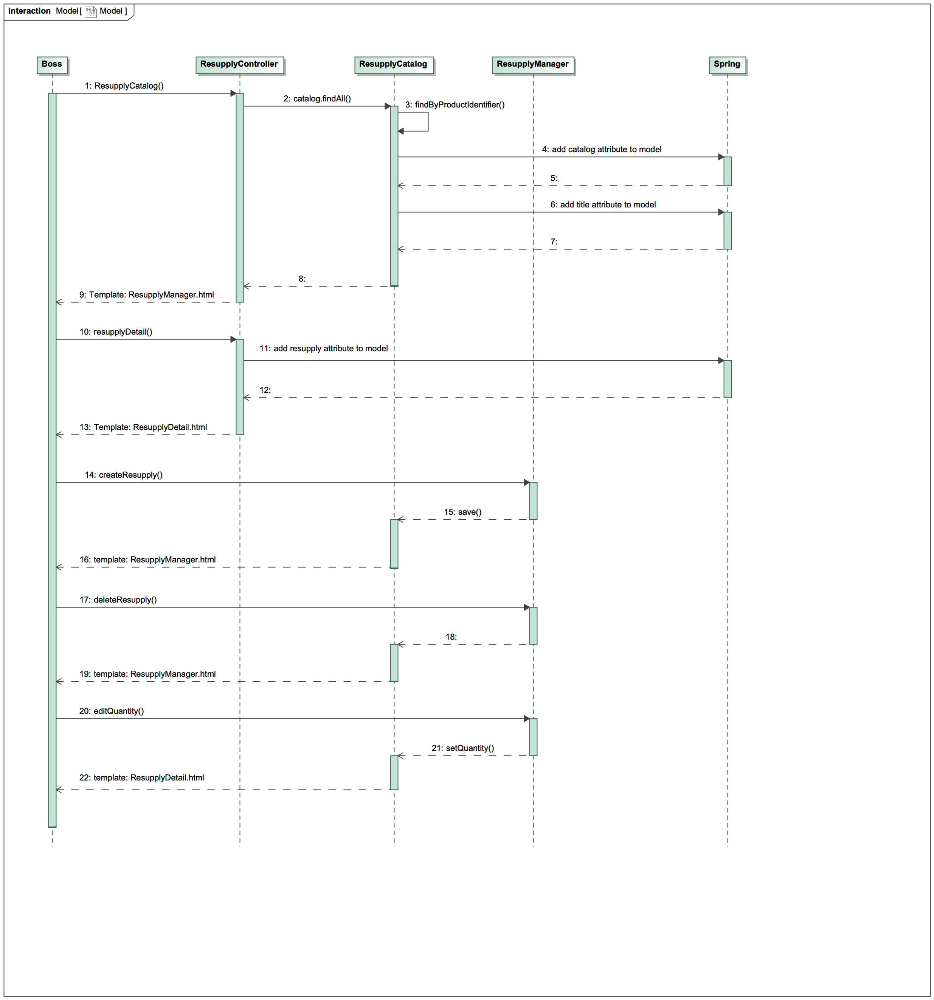

=== Booking

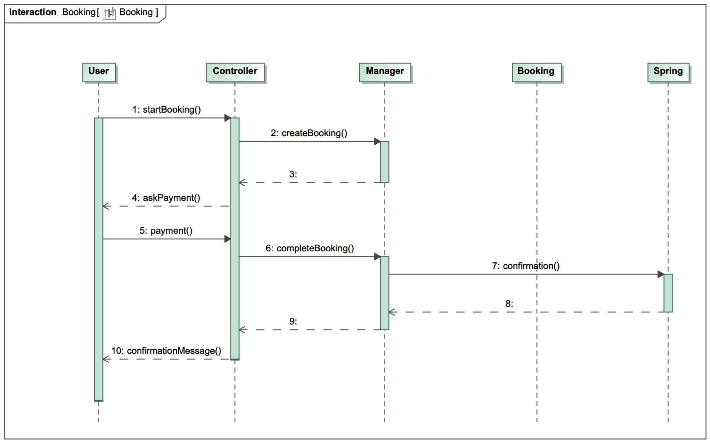

== Technical depts

=== Quality Gates
_Hinweis: In diesem Abschnitt werden alle ausgefallenen Quality Gates aufgelistet. Diese Bewertungen reichen von *A* (beste) bis *E* (schlechteste)._
[options="header"]
|===
|Quality Gate | Actual value | Goal
|Reliability | C | A
|Coverage | 0.0% | 50.0%
|===

=== Issues
_Hinweis: In diesem Abschnitt sind alle SonarQube-Probleme der Priorität *Blocker*, *Critical* und *Major* sowie häufige *Minor*-Probleme aufgeführt._
[options="header"]
[options="header", cols="1, 2, 2, 2"]
|===
|Priority |Description |Location |Corresponding Quality Gate
|Major |The return value of "orElseGet" must be used| videoshop.InventoryInitializer line 66 |Reliability
|Minor |Assign this magic number _X_ to a well-named constant, and use the constant instead a|
* 17 appearances within catalog.CatalogInitializer
* 1 appearance within inventory.InventoryInitializer
* 1 appearance within order.OrderController |None
|Minor |Lines should not be longer than 120 characters a|
* 1 appearance within catalog.Disc
* 1 appearance within customer.Customer
* 1 appearance within customer.RegistrationForm |None
|===
