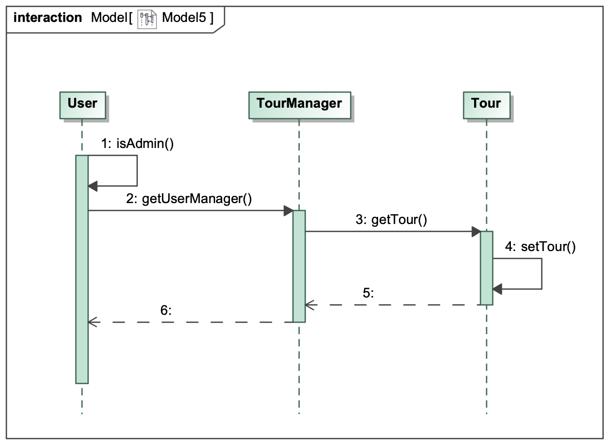

= Pflichtenheft
:project_name: Fahrradreisen
:author: Gruppe 40
:revnumber: 0.1
:revdate: {docdatetime}
:revremark: Work in Prograss
:doctype: book
:icons: font
:source-highlighter: highlights
:toc: left
:toc-title: Inhaltsverzeichnis
:numbered:

== __{project_name}__

[options="header"]
[cols="1, 1, 1, 4, 4"]
|===
|Version | Status      | Bearbeitungsdatum   | Autoren |  Vermerk
|0.1     | In Arbeit   | 10.10.2019          | Marcel Körner      | Initiale Version
||||Marwin Dörschel |
||||Lucas Marting |
|||| Luise Balbier |
|||| Muhammad Ibrahim Rahman |
|||| Julian Möller |
|===

== Zusammenfassung
Dieses Dokument ist das Pflichtenheft der Gruppe 40 mit dem Projekt eine Webanwendung
für einen Kunden, welcher Fahrradtouren in England anbieten möchte, zu entwickeln.
Ziel dieses Dokumentes ist es einen Überblick über die
Funktionen des zukünftigen Programmes zu liefern und den konzeptionellen
Aufbau des Programms zu skizzieren. Es dient dabei in erster Linie um eine gemeinsame
Basis zwischen Kunden und Entwicklern zu bilden, um sich im weiteren Verlauf der
Entwicklung besser koordinieren und verständigen zu können.
Während der Dauer des Projektes dient das Pflichtenheft zur Orientierung und sollte
deshalb vollständig sein. Am Ende der Implementierungsphase wird durch die Dokumentation
das Programm auf Vollständigkeit überprüft.

== Aufgabenstellung und Zielsetzung
Die NBB British Bike Tours veranstaltet exklusiv für deutsche Touristen kulturell
anspruchsvolle, geführte Fahrradtouren in Großbritannien, u.a.

* 8 Tage "Auf dem Whiskey Trail durch Schottland",
* 14 Tage "Burgen und Kathedralen aus acht Jahrhunderten",
* 10 Tage "Die romantische Küste Cornwalls",
* 12 Tage "Auf den Spuren der Römer und Kelten",
* und, und, und, ...

Die Touren werden von erfahrenen Reiseleitern geführt und von einem Tross (Bus für
Fahrradmüde mit Ersatzteilen und Rädern, Proviant, medizinischer Versorgung etc.) begleitet.
Alle Fahrräder werden vom Veranstalter gestellt und gewartet.
Die Touren werden laufend in verschiedenen Preiskategorien angeboten:

* Touristen der Economy Class übernachten in Jugendherbergen oder in bereitgestellten
Zeltlagern in ihren eigenen Schlafsäcken. Die Gemeinschaftsverpflegung ist einfach.
Die gestellten Fahrräder sind robust und praktisch. Anreise per Bahn und Schiff.
* In der Standard Class übernachtet man in B&B-Zimmern und besucht auf eigene Faust
in den Pubs der Umgebung (Tipps dazu vom Reiseleiter). Fahrräder wie in der
Economy Class. Anreise in eigener Regie.
* Kunden der Luxury Class übernachten in Hotels und Landsitzen mit vorzüglicher
Küche. Fahrräder besonders gut gefedert, auf Wunsch mit elektrischem Hilfmotor.
Anreise per Flugzeug. +

Die NBB British Bike Tours benötigen für ihren Firmensitz in Neubiberg bei München
Verwaltungssoftware zur Planung und Organisation von Reiseangeboten sowie zur
Abwicklung von Anfragen, Buchungen, Stornierungen seitens der Kunden per Telefon, FAX,
email oder persönlich. Aus dem Veranstaltungskatalog soll automatisch ein Online-Katalog
auf der Homepage des Veranstalters generiert werden.
Mit der Zentrale und den über ganz Großbritannien verteilten Versorgungsstationen sind
künftig (per Internet) Notebooks verbunden, die von jedem Tross mitgeführt werden, um
Ersatzteilanforderungen, Krankheits- und Versicherungsfälle zu melden. Reiseleitung und
Teilnehmer haben auf diese Weise jederzeit Verbindung zur Zentrale.
Teilnehmer erhalten je Reise einen Treuepunkt. Ab drei Treuepunkten können sie am Ende
einer Reise das verwendete Fahrrad günstig erwerben: Der Preis ergibt sich aus dem
Ladenpreis, der sich für jeden Treuepunkt um 10 % verringert. Mit Erwerb des Fahrrads sind
die Treuepunkte verbraucht.
Ihre Aufgabe ist es, auf der Grundlage von SalesPoint einen Prototypen dieser Software zu
erstellen, in dem die Abteilungen der Zentrale von NBB British Bike Tours, die
Versorgungsstationen sowie die von den Reisegruppen mitgeführten Notebooks als eigene
SalesPoints emuliert werden. Der Kunde möchte damit sein Geschäftsmodell überarbeiten.

== Produktnutzung

Diese Webanwendung soll sowohl von den Organisatoren als auch den Kunden der Fahrradtouren als
Anlaufstelle dienen. Der Kunde soll alle nötigen Informationen über mögliche Touren bereitgestellt bekommen, sowie
die Möglichkeit haben nach abgeschlossener Reise das benutzte Fahrrad käuflich zu erwerben.
Der Organisator oder auch Reiseleiter soll die Möglichkeit haben während den Touren Lieferungen für benötigte
Ersatzteile oder Proviant zu tätigen oder überprüfen können, ob in Versorgungsstationen die benötigten Güter vorliegen.

== Interessensgruppen (Stakeholders)

[options="header"]
[cols="1, 1, 2, 4"]
|===
|Name    | Einstufung (1...5)    | Beschreibung                                                               | Ziele
|Kunde (Tutor)     | 5      | Der Kunde, für den das Programm entworfen und entwickelt wird                  a|  * Bewertung der Studenten beim Arbeiten am Projekt +
                                                                                                                * Verwaltung der Mitarbeiter und Touren +
                                                                                                                * kundenfreundliches Design der Website, nativer Umgang für die
                                                                                                                  Mitarbeiter für schnelle Koordination der Bestellungen etc.
|Mitarbeiter (Reiseleiter)  | 2 | Mitarbeiter des Unternehmens und Führer der Tour a| * Vereinfachte Arbeitsumgebung +
                                                                                      * Einfache Bedienung +
                                                                                      * Schnelle Abarbeitung der Aufträge
|Kunde des Unternehmens | 4 | Kunde, der eine Tour buchen möchte a| * gute Übersichtlichkeit der Angebote +
                                                                    * einfacher Buchungsprozess +
                                                                    * kundenfreundliches Design
| Administrator | 3 | User, der die Mitarbeiter und Kunden verwaltet und Touren erstellt oder löscht a| * Übersicht über alle benötigten Daten +
                                                                                                        * Möglichkeit der Datenverwaltung
| Entwickler  | 3 | Programmierer, die das Programm entwickelt haben a| * leicht erweiterbare Anwedung +
                                                                        * Geringe Wartungs-Notwendigkeit
|===

== Systemgrenze und Top-Level-Architektur

=== Kontextdiagramm

image::./models/analysis/screenshots/2019_11_03_swtp_Kontextdiagramm.png[Context Model,pdfwidth=75%, 100%, 100%, align="center"]

=== Top-Level-Architektur

== Anwendungsfälle

=== Akteure

Im folgenden werden die Akteure, also die Nutzer des Software-Systems, aufgelistet
und kurz beschrieben

// See http://asciidoctor.org/docs/user-manual/#tables
[options="header"]
[cols="1,4"]
|===
|Name |Beschreibung
|unregistrierter Nutzer  |Ein potentieller Kunde, der sich auf der Website über Touren informiert, aber noch kein Kundenkonto besitzt.
|Kunde |Ein Kunde, der sich bereits registriert hat und nun eine Tour buchen oder ein Fahrrad kaufen kann.
|Reiseleiter |Ein Mitarbeiter des Unternehmens, der über die Webanwendung Zugriff auf den Bestand der Versorgungsstationen hat
              Versicherungsfälle melden kann und Teile nachbestellen kann.
|Admin        |Das Unternehmen, das über den Admin Account alle Daten einsehen und bearbeiten kann.
|===

=== Überblick Anwendungsfalldiagramm

Anwendungsfall-Diagramm, das alle Anwendungsfälle und alle Akteure darstellt

=== Anwendungsfallbeschreibungen
Dieser Unterabschnitt beschreibt die Anwendungsfälle. In dieser Beschreibung müssen noch nicht alle Sonderfälle und Varianten berücksichtigt werden. Schwerpunkt ist es, die wichtigsten Anwendungsfälle des Systems zu finden. Wichtig sind solche Anwendungsfälle, die für den Auftraggeber, den Nutzer den größten Nutzen bringen.
Für komplexere Anwendungsfälle ein UML-Sequenzdiagramm ergänzen.
Einfache Anwendungsfälle mit einem Absatz beschreiben.
Die typischen Anwendungsfälle (Anlegen, Ändern, Löschen) können zu einem einzigen zusammengefasst werden.

[cols="1h, 3"]
[[UC0010]]
|===
|ID                         |**<<UC0010>>**
|Name                       |Login/Logout
|Beschreibung                |Ein registrierter Nutzer kann sich ein- und ausloggen, um Touren zu buchen oder ein Fahrrad zu kaufen, sowie Touren stornieren können.
|Akteure                     |Kunde
|Auslöser                    |
_Login_: Kunde möchte Tour buchen/stornieren, beziehunsweise sein Fahrrad kaufen.

_Logout_: Kunde ist fertig mit den oben genannten Aktionen und will die Seite verlassen.
|Vorbedingung           a|
_Login_: Kunde ist bereits registriert, aber nicht eingeloggt.

_Logout_: Kunde ist eingeloggt.
|Wesentliche Schritte           a|
_Login_:

  1. Kunde navigiert zur Login-Oberfläche
  2. Kunde gibt die Nutzerdaten ein
  3. Kunde klickt den Login-Button
  4. Kunde kehrt automatisch zurück zur Übersicht bei erfolgreichem Login

_Logout_:

  1. Kunde drückt aus Logout
  2. Kunde wird ausgeloggt und kehrt automatisch zur Übersicht zurück

|Erweiterungen                |-
|Funktionale Vorraussetzung    |Login/Logout
|===

[cols="1h, 3"]
[[UC0020]]
|===
|ID                         |**<<UC0020>>**
|Name                       |Registrierung eines neuen Nutzers
|Beschreibung                |Ein unregistrierter Nutzer kann sich über die Login-Übersicht neu registrieren.
|Akteure                     |unregistrierter Nutzer
|Auslöser                    |
User beschließt eine Tour zu buchen
|Vorbedingung           a|
User besitzt noch kein Kundenkonto
|Wesentliche Schritte           a|

  1. User navigiert zur Login-Oberfläche
  2. User klickt auf "Neu Registrieren"
  3. User wird zum Registrierungsformular weitergeleitet
  4. User gibt seine Daten an
  5. User klickt auf "Registrieren"
  6. Daten werden validiert
  7. User wird als eingeloggter Kunde zurück zur Übersicht geleitet

|Erweiterungen                |Nachricht bei erfolgreicher Registrierung
|Funktionale Vorraussetzung    |create()
|===

[cols="1h, 3"]
[[UC0030]]
|===
|ID                         |**<<UC0030>>**
|Name                       |Reiseleiter checkt Status eines Ersatzteiles
|Beschreibung                |Der Reiseleiter checkt, ob in der nächsten Station ein benötigtes Ersatzteil vorhanden ist.
|Akteure                     |Reiseleiter
|Auslöser                    |
Ersatzteil wird benötigt
|Vorbedingung           a|
Reiseleiter ist eingeloggt
|Wesentliche Schritte           a|

  1. Reiseleiter navigiert zum Suchformular
  2. Reiseleiter gibt Name das benötigten Items ein
  3. Reiseleiter gibt Versorgungsstation ein
  4. Reiseleiter klickt auf "Verfügbarkeit prüfen"
  5. Status des Ersatzteiles wird angezeigt
  6. Reiseleiter kann Ersatzteil nachbestellen bei mangelnder Verfügbarkeit

|Erweiterungen                |
|Funktionale Vorraussetzung    |Suchen der Items
|===

[cols="1h, 3"]
[[UC0040]]
|===
|ID                         |**<<UC0040>>**
|Name                       |Kunde bucht Tour
|Beschreibung                |Der Kunde hat eine Tour gefunde, die ihm zusagt und will diese buchen.
|Akteure                     |Kunde
|Auslöser                    |
Kunde ist durch den Touren-Katalog navigiert und hat eine Tour ausgewählt.
|Vorbedingung           a|
Kunde ist eingeloggt
|Wesentliche Schritte           a|

  1. Kunde ist auf der Detail-Ansicht einer angebotenen Tour
  2. Kunde drückt auf "Buchen"-Button
  3. Kunde wird weitergeleitet zur Buchungsseite
  4. Kunde wählt Konfigurationen aus (Preisklasse, Zeitpunkt)
  5. Buchung wird ausgeführt
  6. Kunde bekommt Bestätigung

|Erweiterungen                | -
|Funktionale Vorraussetzung    |Buchen einer Tour
|===

[cols="1h, 3"]
[[UC0050]]
|===
|ID                         |**<<UC0050>>**
|Name                       |Kunde storniert Tour
|Beschreibung                |Der Kunde will eine gebuchte Tour stornieren.
|Akteure                     |Kunde
|Auslöser                    |
Kunde kann aus eigenen Gründen die Tour nicht antreten
|Vorbedingung           a|
Kunde ist eingeloggt
|Wesentliche Schritte           a|

  1. Kunde navigiert in seinem Profil zu "meine Touren"
  2. Kunde drückt auf die Tour, die er stornieren will
  3. Kunde klickt auf "Stornieren"
  4. Kunde bekommt Bestätigung, dass die Tour storniert wurde

|Erweiterungen                | -
|Funktionale Vorraussetzung    |Stornieren einer Tour
|===

[cols="1h, 3"]
[[UC0060]]
|===
|ID                         |**<<UC0060>>**
|Name                       |neue Tour erstellen
|Beschreibung                |Administrator erstellt neue Tour
|Akteure                     |Administrator
|Auslöser                    |
Unternehmen hat eine neue Tour geplant
|Vorbedingung           a|
Administrator ist eingeloggt
|Wesentliche Schritte           a|

  1. Administrator navigiert zu "Neue Tour erstellen"
  2. Administrator gibt erforderliche Daten für die Tour ein
  3. Administrator klickt auf "Erstellen"
  4. Administrator bekommt eine Benachrichtigung bei erfolgreicher Erstellung der Tour

|Erweiterungen                | -
|Funktionale Vorraussetzung    |Erstellen einer Tour
|===

[cols="1h, 3"]
[[UC0070]]
|===
|ID                         |**<<UC0070>>**
|Name                       |Reiseleiter bestellt Ersatzteile
|Beschreibung                |Reiseleiter bestellt benötigtes Ersatzteil
|Akteure                     |Reiseleiter
|Auslöser                    |
Reiseleiter benötigt zur Reparatur eines Fahrrads ein Ersatzteil
|Vorbedingung           a|
Reiseleiter ist eingeloggt
|Wesentliche Schritte           a|

  1. Reiseleiter navigiert zu "Ersatzteile bestellen"
  2. Reiseleiter sucht das zu bestellende Ersatzteil
  3. Reiseleiter wählt Anzahl aus
  4. Reiseleiter wählt die zu beliefernde Versorgungsstation aus
  4. Reiseleiter bestellt Teil

|Erweiterungen                | -
|Funktionale Vorraussetzung    |Ersatzteil bestellen
|===

[cols="1h, 3"]
[[UC0080]]
|===
|ID                         |**<<UC0080>>**
|Name                       |Reiseleiter meldet Versicherungsvorfall
|Beschreibung                |Reiseleiter meldet einen Versicherungsvorfall über das Formular
|Akteure                     |Reiseleiter
|Auslöser                    |
Bei der Tour ist ein Kunde verletzt oder erkrankt.
|Vorbedingung           a|
Reiseleiter ist eingeloggt
|Wesentliche Schritte           a|

  1. Reiseleiter navigiert zu "Versicherungsvorfall melden"
  2. Reiseleiter füllt das Formular aus
  3. Reiseleiter wählt betroffenen Kunde aus
  4. Reiseleiter schickt das Formular ab

|Erweiterungen                | -
|Funktionale Vorraussetzung    |Versicherungsvorfall melden
|===

[cols="1h, 3"]
[[UC0090]]
|===
|ID                         |**<<UC0090>>**
|Name                       |Administrator erstellt Reiseleiter
|Beschreibung                |Durch Neueinstellung eines neuen Reiseleiters muss dieser in das System integriert werden
|Akteure                     |Administrator
|Auslöser                    |
Einstellung eines neuen Reiseleiters
|Vorbedingung           a|
Administrator ist eingeloggt
|Wesentliche Schritte           a|

  1. Administrator navigiert zu "Mitarbeiter erstellen"
  2. Administrator füllt die Daten in das Formular
  3. Administrator klickt auf "Erstelllen"

|Erweiterungen                | -
|Funktionale Vorraussetzung    |Reiseleiter erstellen
|===

image::./models/analysis/screenshots/2019_11_03_swtp_Sequenzdiagramm_admin_erstellt_reiseleiter.png[Context Model, pdfwidth=75%,100%, 100%, align="center"]

[cols="1h, 3"]
[[UC0100]]
|===
|ID                         |**<<UC0100>>**
|Name                       |unregistrierter Nutzer sucht Tour
|Beschreibung                |unregistrierter Nutzer navigiert auf die Seite und stöbert durch den Tourenkatalog
|Akteure                     |unregistrierter Nutzer
|Auslöser                    |
Nutzer möchte sich über das Angebot des Unternehmens informieren
|Vorbedingung           a| -
|Wesentliche Schritte           a|

  1. unregistrierter Nutzer navigiert zur Homepage
  2. unregistrierter Nutzer stöbert durch die Angebote
  3. unregistrierter Nutzer kann auf Tourteaser klicken und bekommt eine Detailansicht

|Erweiterungen                | -
|Funktionale Vorraussetzung    |Anzeige des Tourenkatalogs
|===

[cols="1h, 3"]
[[UC0110]]
|===
|ID                         |**<<UC0110>>**
|Name                       |Tour löschen
|Beschreibung               |Administrator löscht schon existierende Tour, sodass diese nicht mehr existiert.
|Akteure                    |Administrator
|Auslöser                   |Unternehmen möchte eine Tour nicht mehr anbieten.
|Vorbedingung           	|Administrator ist eingeloggt und Tour wurde vorher erstellt.
|Wesentliche Schritte           a|
  1. Administrator navigiert zur Tour
  2. Administrator wählt "Tour löschen" aus
  3. Fenster mit "Wollen Sie wirklich diese Tour löschen?" und zwei Buttons ("Ja"/"Nein") erscheint
  4. Administrator drückt "Nein", die Löschung der Tour wird abgebrochen
  5. Administrator drückt "Ja", Administrator bekommt eine Benachrichtigung bei erfolgreicher Löschung der Tour

|Erweiterungen                |-
|Funktionale Vorraussetzung    |Löschung einer Tour
|===

[cols="1h, 3"]
[[UC0120]]
|===
|ID                         |**<<UC0120>>**
|Name                       |Tour bearbeiten
|Beschreibung               |Administrator bearbeitet existierende Tour
|Akteure                    |Administrator
|Auslöser                   |Unternehmen möchte Daten einer Tour ändern
|Vorbedingung           	|Administrator ist eingeloggt und Tour wurde vorher erstellt.
|Wesentliche Schritte           a|
  1. Administrator navigiert zur Tour
  2. Administrator wählt "Tour bearbeiten" aus
  3. Fenster verändert sich, dass die Daten der Tour bearbeitbar werden
  4. Administrator bearbeitet die Daten der Tour
  5. Administrator drückt "Bestätigen"
  6. Administrator bekommt eine Benachrichtigung bei erfolgreicher Änderung der Tour
  6. Administrator wird zurück geleitet auf Tourdetailansicht

|Erweiterungen                |-
|Funktionale Vorraussetzung    |Bearbeitung einer Tour
|===

== Funktionale Anforderungen

=== Muss-Kriterien
Was das zu erstellende Programm auf alle Fälle leisten muss.

==== Anmeldung/Registrierung
[A0001]Ein registrierter Nutzer kann sich anmelden +
[A0002]Ein registrierter Nutzer kann sein Kennwort ändern +
[A0003]Ein registrierter Nutzer kann seine Daten verändern +
[A0004]Ein unregistrierter Nutzer muss sich bei Buchungen oder Käufen anmelden +
[A0005]Der Administrator kann alle Nutzer verwalten

==== User-Verwaltung
[U0001]Der Admin kann alle Nutzer der Seite verwalten +
[U0002]Der Admin kann neue Reiseleiter hinzufügen +
[U0003]Der Admin kann alle Reiseleiter bearbeiten +
[U0004]Der Admin kann Reiseleiter löschen

==== Registrierung
[R0001]Ein unregistrierter Nutzer kann ein Konto erstellen +
[R0002]Ein unregistrierter Nutzer kann ein Passwort erstellen

==== Tour-Management
[T0001]Der Administrator kann Touren erstellen/löschen +
[T0002]Der Administrator kann Touren bearbeiten +
[T0003]Der Administrator kann sich alle Touren anzeigen lassen

==== Fahrrad-Management
[F0001]Der Kunde kann sein Fahrrad kaufen +
[F0002]Der Kunde kann sein Fahrrad einsehen

==== Buchung
[B0001]Der Kunde kann eine Tour buchen +
[B0002]Der Kunde kann eine Tour stornieren +
[B0003]Der Kunde kann eine Preisklasse wählen

==== Inventory-Management
[I0001]Der Reiseleiter kann Teilebestände in Versorgungsstationen einsehen +
[I0002]Der Reiseleiter kann Teile bestellen

==== Versorgungsmanagement
[V0001]Der Reiseleiter kann Versorgungsgüterbestände abrufen +
[V0002]Der Reiseleiter kann Versorgungsgüter bestellen

==== Versicherungsmanagement
[V0003]Der Reiseleiter kann Versicherungsvorfälle melden

=== Kann-Kriterien
Anforderungen die das Programm leisten können soll, aber für den korrekten Betrieb entbehrlich sind.

* Bei Stornierung einer Buchung wählt der Kunde einen Grund aus und gibt einen kleinen Text ein
* Kommentare und Bewertungen zu Touren verfassen können.

== Nicht-Funktionale Anforderungen

=== Qualitätsziele

1 = Nicht wichtig ..
5 = Sehr wichtig
[options="header", cols="3h, ^1, ^1, ^1, ^1, ^1"]
|===
|Qualitätsstufe           | 1 | 2 | 3 | 4 | 5
|Benutzerfreundlichkeit   |   |   |   |   |x
|Erweiterbarkeit          |   |   | x |   |
|Funktionalität           |   |   |   | x |
|Skalierbarkeit           |   | x |   |   |
|Sicherheit               |   |   |   | x |
|Effektivität             |   |   | x |  |
|Leistung                 |   |   | x |  |
|===

=== Konkrete Nicht-Funktionale Anforderungen

*Blocker Regeln* +
(1) Quelldateien sollten keine duplizierten Blöcke haben. +
(2) magische Zahlen sollten nicht verwendet werden (außer 1,0,-1). Eine magische Zahl ist die Verwendung einer hartkodierten Zahl im Code. +
(3) Klassenvariablen sollten keine öffentliche Zugänglichkeit haben. +
*Kritische Regeln* +
(4) Dateien sollten nur eine Top-Klasse oder eine Schnittstelle enthalten. +
(5) Die Zeilen sollten durch Einheitstests eine ausreichende Abdeckung (80%) aufweisen. +
(6) Öffentliche Typen, Methoden und Felder (API) sollten mit Javadoc dokumentiert werden. +
(7) Klassen sollten nicht an zu viele andere Klassen gekoppelt werden (Single Responsibility Principle, höchstens 10), und es sollte keine Zyklen zwischen den Paketen geben. +
(8) Halten Sie die Dinge klein!  Die Klassen sollten nicht zu viele Methoden haben (höchstens 10).  Die Dateien sollten nicht zu viele Zeilen haben (höchstens 400). Die Methoden sollten nicht zu viele Zeilen haben (höchstens 40). Die inneren Klassen sollten nicht zu viele Zeilen haben (höchstens 25). +
(9) Alle Namen sollten den Java-Naming-Konventionen mit mindestens 2 und höchstens 50 Zeichen folgen: https://www.safaribooksonline.com/library/view/java-8pocket/9781491901083/ch01.html +
*Major Rules* +
(10) Nicht zu viel Komplexität!  +
Die Methoden sollten nicht zu viele Parameter haben (höchstens 5). Die Statements (If, For, ...)
sollten nicht zu tief verschachtelt werden (höchstens 3).
Die McCabe-Komplexität der Methoden sollte höchstens 10 und für Klassen maximal 40 betragen. McCabe Komplexität wird hier erklärt: https://www.leepoint.net/principles_and_practices/complexity/complexityjava-method.html +
(11) Halten Sie die Dinge klar!  Kindklassen sollten nicht die Oberklassen (https://en.wikipedia.org/wiki/Variable_shadowing) überschatten. Das bedeutet, dass die Namen der Variablen von den Namen abweichen sollten, die in einem äußeren Bereich verwendet werden. Zum Beispiel sollte eine lokale Variable nicht den gleichen Namen wie eine Instanzvariable haben, Namen sollten sich nicht nur durch Kapitalisierung unterscheiden, und wörtliche Suffixe (wie L für Long) sollten Upper Case sein. +
(12) Sei Konsistent in der Formatierung!  +
Die geschwungene Klammer am Ende der Linie und die geschwungene Klammer am Anfang einer Linie setzen. +
Verwenden Sie geschwungene Klammern in Kontrollstrukturen (if, for ...) +
Keine Tabulatoren Benutzen +
Maximale Länge der Zeilen: 120 +
Nur ein Statement pro Zeile +
*Kleinere Regeln* +
(13)  "static " members sollten statisch abgerufen werden. +
(14) Objekte sollten mit  "equals () " verglichen werden. +
(15)  "switch "-Anweisungen sollten mit  "default "-Klauseln enden, und alle Fälle sollten mit einer Break-Anweisung enden. +
(16) Nutzlose Importe sollten entfernt werden, und Wildcard-Importe sollten nicht verwendet werden. +
(17) Mehrere Variablen sollten nicht auf derselben Zeile deklariert werden. Sichtbarkeit sollte immer deklariert werden (öffentlich, privat, geschützt). +
(18) Alle ungenutzten Codes sollten entfernt werden (Methoden, Felder, Variablen, Parameter, ...). +
*Info-Regeln* +
(19)  "TODO "-Tags sollten behandelt werden. Kommentierter Code sollte entfernt werden. +

== GUI Prototyp

=== Überblick: Dialoglandkarte

Erstellen Sie ein Übersichtsdiagramm, das das Zusammenspiel Ihrer Masken zur Laufzeit darstellt. Also mit welchen Aktionen zwischen den Masken navigiert wird.
//Die nachfolgende Abbildung zeigt eine an die Pinnwand gezeichnete Dialoglandkarte. Ihre Karte sollte zusätzlich die Buttons/Funktionen darstellen, mit deren Hilfe Sie zwischen den Masken navigieren.

=== Dialogbeschreibung

NOTE: Generell besitzt jedes dieser Ansichten eine Navigationsbar mit welcher man
zu allen wichtigen Kategorien je nach Rolle navigieren kann.

Screen 1: Katalog +
Der erste Screen gibt dem Nutzer direkt eine klare Übersicht über die angebotenen
Touren, diese werden in Teaserform angezeigt. Bei Klick auf einen Teaser kommt man auf die
Tour-Detailansicht. Die komplette Navigation erfolgt über die Navigationsbar.

Screen 2: Tour-Detailansicht +
Auf dieser Seite bekommt man eine detailierte Beschreibung der Tour, sowie die
verfügbaren Daten für die Reise. Hier kann man auch über einen Buchungs-Button
zum Buchungsmanagement weitergeleitet werden.

Screen 3: Buchungsmanagement +
Über die Seite kann man ja nach Rolle als Kunde eine Buchung abschließen oder als Admin
alle Buchungen einsehen.

Screen 4: Login +
Hier wird ein einfaches Formular angezeigt, welches aus E-Mail
und Passwort besteht und einem Login-Button +

Screen 5: Registrierung +
Formularansicht um einen neuen Nutzer zu erstellen. Besteht aus mehreren Input-Feldern, für
die essentiellen Informationen um ein Kundenkonto zu erstellen. +

Screen 6: Warenkorb +
Ansicht für den Kunden über die ausgewählte Tour, welche er über den Warenkorb kaufen kann. +

Screen 7: User-Management +
Ansicht aller Kundendaten für den Administrator

Screen 8: Inventory-Management +
Ansicht für den Reiseleiter um Ersatzteile in einer Versorgungsstation einzusehen. +

Screen 9: Tour-Management +
Auf dieser Seite kann der Admin alle Touren einsehen, bearbeiten und neue erstellen oder alte löschen +

Screen 10: Inventory-Management +
Auf dieser Seite kann der Reiseleiter Vorräte an Proviant und medizinischer Versorgungsgüter für
Versorgungsstaionen einsehen. +

Screen 11: Fahrrad +
Der Kunde kann über diese Ansicht sein Fahrrad einsehen und darüber kaufen.

== Datenmodell

=== Überblick: Klassendiagramm

=== Klassen und Enumerationen
Dieser Abschnitt stellt eine Vereinigung von Glossar und der Beschreibung von Klassen/Enumerationen dar. Jede Klasse und Enumeration wird in Form eines Glossars textuell beschrieben. Zusätzlich werden eventuellen Konsistenz- und Formatierungsregeln aufgeführt.

// See http://asciidoctor.org/docs/user-manual/#tables
[options="header"]
[cols="1, 3"]
|===
|Klasse/Enumeration |Beschreibung
|Kunde              |Generelle Repräsentation eines realen Kunden mit Attributen essentiell für die Buchung einer Tour. Wird nur kreiert, wenn sich ein User registriert.
|Buchung            |Wird benutzt, um zu repräsentieren, welche Tour ein registrierter User (Kunde) buchen möchte. Welche Preisklasse und welche Tour er wählt, werden hier zusammengeführt.
|Stornierung        |Wenn der Kunde eine gebuchte Tour nicht antreten kann, wird die Klasse Stornierung benutzt, um den Kuden aus einer gebuchten Tour zu entfernen.
|Tour               |Die Tour ist die Instanz einer realen geplanten Tour durch England.
|Rad                |Repräsentiert ein reales Fahrrad, welches vom Kunden nach Beendigung einer Tour gekauft werden.
|Preisklasse        |In der Preisklasse wird festgehalten, welche Unterkunft und Anreiseart für den Kunden bereitgestellt werden.
|Versicherung       |Versicherung für die Tour, die vom Kunden automatisch abgeschlossen wird, wenn dieser eine Tour bucht. Preis kann je nach Preisklasse variieren.
|Reiseleiter        |Repräsentation eines realen Reiseleiters, hat eine spezielle Rolle auf der Website und andere Ansichten als ein Kunde.
|Tross              |Der Tross ist die Verbindung zwischen Reiseleiter und Tour
|Versorgung         |Sind Elemente, die in der Versorgungsstation vorliegen, wie etwa Proviant oder medizinische Versorgung. Kann über das Notebook bestellt werden.
|Notebook           |Repräsentiert ein reales Notebook, über das der Reiseleiter Bestellungen absetzen kann, um Versorgungsstationen zu befüllen oder bestimmte Items zu bestellen.
|Ersatzteile        |Stellt ein reales Ersatzteil und dessen vorrätige Anzahl dar.
|Versorgungsstationen|Beschreibt eine reale Versogrúngsstation mit Ersatzteilen und Versorgungsgütern.
|===

== Akzeptanztestfälle
Mithilfe von Akzeptanztests wird geprüft, ob die Software die funktionalen Erwartungen und Anforderungen im Gebrauch erfüllt. Diese sollen und können aus den Anwendungsfallbeschreibungen und den UML-Sequenzdiagrammen abgeleitet werden. D.h., pro (komplexen) Anwendungsfall gibt es typischerweise mindestens ein Sequenzdiagramm (welches ein Szenarium beschreibt). Für jedes Szenarium sollte es einen Akzeptanztestfall geben. Listen Sie alle Akzeptanztestfälle in tabellarischer Form auf.
Jeder Testfall soll mit einer ID versehen werde, um später zwischen den Dokumenten (z.B. im Test-Plan) referenzieren zu können.

[cols="1h, 4"]
[[AT0010]]
|===
|ID					|<<AT0010>>
|Anwedungsfall		|<<UC0060>>
|Vorbedingung(en)		|Administrator eingeloggt
|Ereignis    			|Administrator klickt "Tour erstellen"
|Erwartetes Resultat	a|
 - Neues Fenster entsteht
 - Administrator gibt Daten zur Tour an
 - Administrator klickt auf "Bestätigen"
 - Tourdetailansicht erscheint
 - Tour ist in Katalog eingetragen
|===

[cols="1h, 4"]
[[AT0020]]
|===
|ID					|<<AT0020>>
|Anwedungsfall		|<<UC0120>>
|Vorbedingung(en)		|Mind. eine Tour existiert und Administrator ist eingeloggt
|Ereignis    			|Administrator klickt "Tour bearbeiten" bei Tourdetailansicht.
|Erwartetes Resultat	a|
 - Seite verändert sich und Tour ist nun bearbeitbar
 - Administrator ändert den Beschreibungstext
 - Administrator klickt auf "Bestätigen"
 - Tourdetailansicht erscheint wieder
|===

[cols="1h, 4"]
[[AT0030]]
|===
|ID					|<<AT0030>>
|Anwedungsfall		|<<UC0110>>
|Vorbedingung(en)		|Mind. eine Tour existiert und Administrator ist eingeloggt
|Ereignis    			|Administrator klickt "Tour löschen" und bestätigt dies.
|Erwartetes Resultat	a|
 - Tour wird gelöscht aus dem Katalog
 - Administrator bekommt Benachrichtigung, dass Tour erfolgreich gelöscht wurde
 - Administrator wird zurück zum Katalog geleitet
|===

[cols="1h, 4"]
[[AT0040]]
|===
|ID            		|<<AT0040>>
|Anwendungsfall		|<<UC0070>>
|Vorbedingung(en)        	a|Ein User ist als "Reiseleiter" angemeldet
|Ereignis     			a|Ein "Reiseleiter" fordert neues Material an
|Erwartetes Resultat    	a|Daten werden an die Zentrale weitergeleitet und diese stellt dann dem Tross oder der Versorgungsstationen das Material zur verfügung.
|===

[cols="1h, 4"]
[[AT0050]]
|===
|ID            |<<AT0050>>
|Anwendungsfall		|<<UC0080>>
|Vorbedingung(en)        	a|Ein User ist als "Reiseleiter" angemeldet
|Ereignis      			a|Ein "Reiseleiter" meldet einen Versicherungsfall
|Erwartetes Resultat     	a|Daten werden ins System eingetragen
|===

[cols="1h, 4"]
[[AT0060]]
|===
|ID            |<<AT0060>>
|Anwendungsfall		|<<UC0050>>
|Vorbedingung(en)        	a|Ein User ist als "Kunde" angemeldet
|Ereignis      			a|Ein "Kunde" beantragt eine Stonierung für eine Tour.
|Erwartetes Resultat     	a|Daten werden an die Zentrale weitergeleitet und geprüft. Ist die Stonierung möglich wird sie genemigt.
|===

[cols="1h, 4"]
[[AT0070]]
|===
|ID            |<<AT0070>>
|Anwendungsfall		|<<UC0030>>
|Vorbedingung(en)        	a|Ein Tross existiert und ein Reiseleiter
|Ereignis      		       	a|Reiseleiter benutzt Material
|Erwartetes Resultat     	a|benutzung wird gespeichert. bei unzureichender Anzahl wird nachbestellt
|===

[cols="1h, 4"]
[[AT0080]]
|===
|ID            |<<AT0080>>
|Anwendungsfall		|<<UC0020>>
|Vorbedingung(en)        	a|Ein unregistrierter User
|Ereignis      		       	a|User registriert sich mit den Daten:
| a|
- Name      : Hans
- Passwort  : 123
- Email     : hans@email.de
|Erwartetes Resultat     	a|
- User Hans wird als Kunde gespeichert
- wird weitergeleitet auf die Startseite
- User ist noch unangemeldet
|===

[cols="1h, 4"]
[[AT0090]]
|===
|ID            |<<AT0090>>
|Anwendungsfall		|<<UC0020>>
|Vorbedingung(en)        	a|Ein unregistrierter User
|Ereignis      		       	a|User registriert sich mit den Daten:
| a|
- Name      : Hans
- Passwort  : 123
- Email     : hans@email.de
|Erwartetes Resultat     	a|
- Eine Errormeldung öffnet sich, weil Username Hans schon vergeben ist
- User bleibt unangemeldet und Das Registrierungsformular bleibt offen
|===

[cols="1h, 4"]
[[AT0100]]
|===
|ID            |<<AT0100>>
|Anwendungsfall		|<<UC0040>>
|Vorbedingung(en)        	a|Ein User ist als "Kunde" angemeldet
|Ereignis      		       	a|Kunde bucht Tour mit folgeden Daten:
| a|
- Tour
- Reisezeit
- Preisklasse
|Erwartetes Resultat     	a|Buchung wird gespeichert und eine Bestätigungsinfo öffnet sich
|===

[cols="1h, 4"]
[[AT0110]]
|===
|ID            |<<AT0110>>
|Anwendungsfall		|<<UC0040>>
|Vorbedingung(en)        	a|Ein User ist als "Kunde" angemeldet
|Ereignis      		       	a|Kunde bucht Tour mit folgeden Daten:
| a|
- Tour
- Reisezeit
- Preisklasse
|Erwartetes Resultat     	a|Eine Errormeldung öffnet sich, weil die Tour schon voll ist oder zu der Zeit keine Tour existiert
|===

[cols="1h, 4"]
[[AT0120]]
|===
|ID            |<<AT0120>>
|Anwendungsfall		|<<UC0010>>
|Vorbedingung(en)        	a|Es gibt registrierte User im System
|Ereignis      		       	a|Kunde versucht sich anzumelden mit den folgenden Daten:
| a|
- Name : Hans
- Passwort : 123
|Erwartetes Resultat     	a|User wird als Hans angemeldet und kann Funktionen von Kunden nutzen
|===

[cols="1h, 4"]
[[AT0130]]
|===
|ID            |<<AT0130>>
|Anwendungsfall		|<<UC0010>>
|Vorbedingung(en)        	a|Es gibt registrierte User im System
|Ereignis      		       	a|Kunde versucht sich anzumelden mit den folgenden Daten:
| a|
- Name : Hans
- Passwort : 456
|Erwartetes Resultat     	a|eine Errormeldung öffnet sich mit der Nachricht "Flasches Passwort oder Nutzername" und der User wird nicht angemeldet.
|===

[cols="1h, 4"]
[[AT0140]]
|===
|ID                        |<<AT0140>>
|Anwendungsfall		         |<<UC0***>>
|Vorbedingung(en)        	a|
1. Der Fahrradbestand ist nicht leer
2. Der User versucht ein Fahrrad zu kaufen
|Ereignis      		       	a|Der User fügt das Fahrrad in den Warenkorb ein
|Erwartetes Resultat     	a|
1. Der user wird ein Überblick seines Warenkorbs gezeigt und kann zum Checkout gehen.
2. Nach Checkout bekommt der User eine Kaufbestätigung
|===

[cols="1h, 4"]
[[AT0150]]
|===
|ID                        |<<AT0150>>
|Anwendungsfall		         |<<UC0***>>
|Vorbedingung(en)        	a|
1. Der User bucht ein Tour
2. Die Buchung wird nicht storniert.
3. Der Tour ist abgeschlossen.
|Ereignis      		       	a|Der User erwerbt 1 Treuepunkt.
|Erwartetes Resultat     	a|Die Zahl der der gespeicherte Treuepunkten des Users ist sich um 1 erhöht.
|===

[cols="1h, 4"]
[[AT0160]]
|===
|ID                        |<<AT0160>>
|Anwendungsfall		         |<<UC0***>>
|Vorbedingung(en)        	a|
1. Der User versucht ein Fahrrad zu kaufen
2. Der User kommt an die Kasse an.
3. Der User hat mindestens 1 Treuepunkt
|Ereignis      		       	a|Der User wählt die Zahl der Treuepunkte (x) er verbrauchen möchte
|Erwartetes Resultat     	a|
1. Der Preis wird um 10x% reduziert und angezeigt
2. Nach bestätigung des Kaufs wird die gespeicherte Zahl der Users Treuepunkten um x reduziert
|===

[cols="1h, 4"]
[[AT0170]]
|===
|ID                        |<<AT0170>>
|Anwendungsfall		         |<<UC0***>>
|Vorbedingung(en)        	a|
1. Der User kommt an die Kasse an.
2. Der User versucht einen Betrag der Treuenpunkten zu wählen während des Fahrradkaufs.
3. Der User hat mehr als 10 Treuepunkte.
|Ereignis      		       	a|Der User wählt die Zahl der Treuepunkte er verbrauchen möchte
|Erwartetes Resultat     	a|Der User kann mehr als 10 Treuepunkte nicht wählen
|===

[cols="1h, 4"]
[[AT0180]]
|===
|ID            |<<AT0180>>
|Anwendungsfall		|<<UC0070>>
|Vorbedingung(en)        	a|Eine Versorgungsstation und Versorgung
|Ereignis      		       	a|Eine Versorgungsstation enthält Versogung
|Erwartetes Resultat     	a|Versorgungsgüter sind abrufbar
|===

[cols="1h, 4"]
[[AT0190]]
|===
|ID            |<<AT0190>>
|Anwendungsfall		|<<UC0070>>
|Vorbedingung(en)        	a|Eine Versorgungsstation und Versorgung
|Ereignis      		       	a|Zu einer Versorgungsstation kann Versogung bestellt werden
|Erwartetes Resultat     	a|Versorgungsgüter sind bestellt und an der Station verfügbar
|===

== Glossar
Sämtliche Begriffe, die innerhalb des Projektes verwendet werden und deren gemeinsames Verständnis aller beteiligten Stakeholder essentiell ist, sollten hier aufgeführt werden.
Insbesondere Begriffe der zu implementierenden Domäne wurden bereits beschrieben, jedoch gibt es meist mehr Begriffe, die einer Beschreibung bedürfen. +
Beispiel: Was bedeutet "Kunde"? Ein Nutzer des Systems? Der Kunde des Projektes (Auftraggeber)?

[cols="1h, 4"]
|===
|Klasse/Enumeration |Beschreibung
|Kunde              |Generelle Repräsentation eines realen Kunden mit Attributen essentiell für die Buchung einer Tour. Wird nur kreiert, wenn sich ein User registriert.
|Projektkunde	    |Synonym für den Kunden des Projekts (Lehrstuhl für Softwaretechnologie).
|Login		    |Fenster, in dem sich abhängig von der URL nach der Anmeldung die noramle Startseite oder das Bestellfenster für den Reiseleiter öffnet.
|Bestellfenster     |Fenster, in dem der Reiseleiter nach Anmeldung Ersatzteile zu Versorgungsstationen bestellen kann.
|Buchung            |Wird benutzt, um zu repräsentieren, welche Tour ein registrierter User (Kunde) buchen möchte. Welche Preisklasse und welche Tour er wählt, werden hier zusammengeführt.
|Stornierung        |Wenn der Kunde eine gebuchte Tour nicht antreten kann, wird die Klasse Stornierung benutzt, um den Kuden aus einer gebuchten Tour zu entfernen.
|Tour               |Die Tour ist die Instanz einer realen geplanten Tour durch England.
|Rad                |Repräsentiert ein reales Fahrrad, welches vom Kunden nach Beendigung einer Tour gekauft werden.
|Preisklasse        |In der Preisklasse wird festgehalten, welche Unterkunft und Anreiseart für den Kunden bereitgestellt werden.
|Versicherung       |Versicherung für die Tour, die vom Kunden automatisch abgeschlossen wird, wenn dieser eine Tour bucht. Preis kann je nach Preisklasse variieren.
|Reiseleiter        |Repräsentation eines realen Reiseleiters, hat eine spezielle Rolle auf der Website und andere Ansichten als ein Kunde.
|Tross              |Der Tross ist die Verbindung zwischen Reiseleiter und Tour
|Versorgung         |Sind Elemente, die in der Versorgungsstation vorliegen, wie etwa Proviant oder medizinische Versorgung. Kann über das Notebook bestellt werden.
|Notebook           |Repräsentiert ein reales Notebook, über das der Reiseleiter Bestellungen absetzen kann, um Versorgungsstationen zu befüllen oder bestimmte Items zu bestellen.
|Ersatzteile        |Stellt ein reales Ersatzteil und dessen vorrätige Anzahl dar.
|Versorgungsstationen|Beschreibt eine reale Versogrúngsstation mit Ersatzteilen und Versorgungsgütern.
|Kauf		    |Möglichkeit für Treuepunkte ein Fahrrad zu erwerben
|Treuepunkte	    |Punkte, die dem Konto hinzugefügt werden, sobald eine Tour beendet ist
|===

== Offene Punkte
Offene Punkte werden entweder direkt in der Spezifikation notiert. Wenn das Pflichtenheft zum finalen Review vorgelegt wird, sollte es keine offenen Punkte mehr geben.
